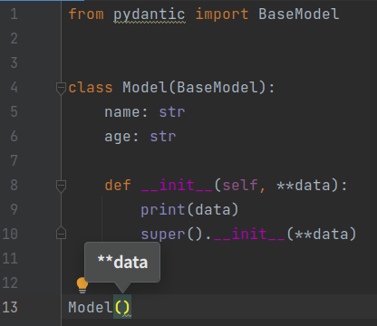

# Ignore `__init__` method arguments 


!!! info    
    **This feature is in version 0.3.4 or later**

You can write `__init__` method on a model for adding some logic.

However, default arguments on `__init__` method will be overridden, And you will lose autocompletion for `__init__` methods by the plugin.  


 
`ignore-init-method-arguments` option resolves this problem.
The option ignore arguments on `__init__` method.


The option has to be defined in pyproject.toml

```toml
[tool.pydantic-pycharm-plugin]
ignore-init-method-arguments = true

```
