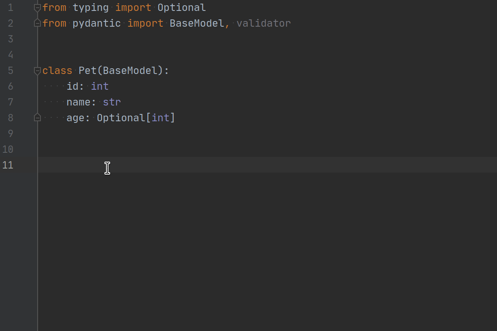
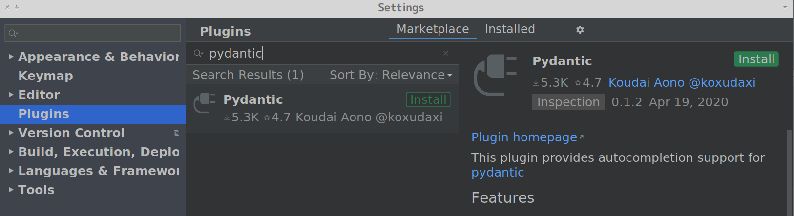

# Pydantic PyCharm Plugin

[A JetBrains PyCharm plugin](https://plugins.jetbrains.com/plugin/12861-pydantic) for [`pydantic`](https://github.com/samuelcolvin/pydantic).

## Interview
I got interviewed about this plugin for [JetBrains' PyCharm Blog](https://blog.jetbrains.com/pycharm/2020/04/interview-koudai-aono-author-of-pydantic-plugin-for-pycharm/).

## Sponsors

##  Features
### Implemented
#### pydantic.BaseModel
* Model-specific `__init__`-signature inspection and autocompletion for subclasses of `pydantic.BaseModel`
* Model-specific `__init__`-arguments type-checking for subclasses of `pydantic.BaseModel` 
* Refactor support for renaming fields for subclasses of `BaseModel`
  * (If the field name is refactored from the model definition or `__init__` call keyword arguments, PyCharm will present a dialog offering the choice to automatically rename the keyword where it occurs in a model initialization call.)
* Search related-fields by class attributes and keyword arguments of `__init__` with `Ctrl+B` and `Cmd+B`
* Provide an inspection for type-checking which is compatible with pydantic. the inspection supports `parsable-type`. the detail is at [Inspection for type-checking section](https://koxudaxi.github.io/pydantic-pycharm-plugin/type-checking/)
* Insert unfilled arguments with a QuickFix for subclasses of `pydantic.BaseModel`
* Support typing.Annotated (PEP 593)
* Regex arguments in `Field` and `constr` are treated as Python's regex string literals

#### pydantic.generics.GenericModel
* Support same features as `pydantic.BaseModel`
  * (This plugin version 0.3.1 or later)

#### pydantic.dataclasses.dataclass
* Support same features as `pydantic.BaseModel`
  * (After PyCharm 2020.1 and this plugin version 0.1.0, PyCharm treats `pydantic.dataclasses.dataclass` as third-party dataclass.)
  * Exclude a feature which is inserting unfilled arguments with a QuickFix

### pydantic.create_model [experimental]
* Support minimum features for a model which is created by create_model  

## Demo

## Quick Installation
The plugin is in Jetbrains repository ([Pydantic Plugin Page](https://plugins.jetbrains.com/plugin/12861-pydantic))

You can install the stable version on PyCharm's `Marketplace` (Preference -> Plugins -> Marketplace) [Official Documentation](https://www.jetbrains.com/help/idea/managing-plugins.html)

**The plugin requires PyCharm 2020.2 or later (include other JetBrains IDEs)**
 

## Contribute
We are waiting for your contributions to `pydantic-pycharm-plugin`.

## Links
### JetBrains Plugin Page
[Pydantic Plugin Page](https://plugins.jetbrains.com/plugin/12861-pydantic)

### Motivation
[Auto-completion when instantiating BaseModel objects #650](https://github.com/samuelcolvin/pydantic/issues/650)

### Other PyCharm plugin projects
[Poetry PyCharm Plugin](https://github.com/koxudaxi/poetry-pycharm-plugin/)

## This project is currently in an experimental phase
