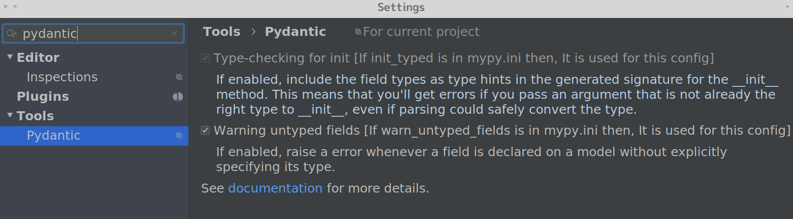

# Mypy Compatible

!!! info    
    **This feature is in version 0.1.4 or later**
   
This plugin is compatible with the [pydantic-mypy plugin](https://pydantic-docs.helpmanual.io/mypy_plugin/), which is included in pydantic package.

If you set supported features in mypy.ini then, the pycharm plugin performs the same inspects.

## Support features
- init_typed
- warn_untyped_fields

### init_typed
If enabled, include the field types as type hints in the generated signature for the __init__ method. This means that you'll get errors if you pass an argument that is not already the right type to __init__, even if parsing could safely convert the type.

### warn_untyped_fields
If enabled, raise a error whenever a field is declared on a model without explicitly specifying its type.

## Settings

You can toggle these features in PyCharm's Settings.

!!! tips    
    **If there is mypy.ini in your project, this plugin use values in mypy.ini**
