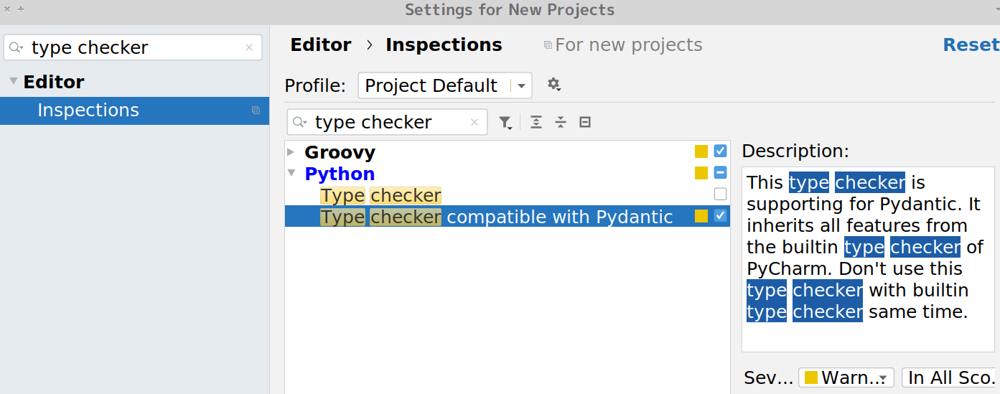

# Type checker for pydnatic
!!! warning
    **Experimental feature**
    
!!! info    
    **In version 0.1.1, This feature is broken. Please use it in [0.1.2](https://github.com/koxudaxi/pydantic-pycharm-plugin/releases/tag/0.1.2) or later.** 

!!! tips
    **This plugin supports type-checking to pydantic with a built-in type checker.
      Plus, this type-checker supplies a special feature to pydnatic. **
          
This plugin provides a type checker for pydantic.

You can use the inspection on PyCharm's Settings (Preference -> Editor -> Inspections -> `Type checker compatible with Pydantic`) 

This inspection inherits from PyCharm's built-in type checker (aka `Type checker`).

Please disable `Type checker` when you enable `Type checker compatible with Pydantic.`

Don't use this type checker with a builtin type checker same time.



## Parsable Type
Pydantic has lots of support for coercing types. However, PyCharm  gives a message saying only `Expected type "x," got "y" instead:`
When you set parsable-type on a type, then the message will be changed to `Field is of type "x", "y" may not be parsable to "x"`


### Set parsable-type in pyproject.toml
You should create `pyproject.toml` in your project root.
And, you define parsable-type like a example.

exapmle: `pyproject.toml`

```toml
[tool.pydantic-pycharm-plugin.parsable-types]

# str field may parse int and float
str = ["int", "float"]

# datetime.datetime field may parse int
"datetime.datetime" = [ "int" ]

# your_module.your_type field may parse str
"your_module.your_type" = [ "str" ]

[tool.pydantic-pycharm-plugin]
# You can set higlith level (default is "warning")
# You can select it from "warning",  "weak_warning", "disable" 
parsable-type-highlight = "warning" 

## If you set acceptable-type-highlight then, you have to set it at same depth.
acceptable-type-highlight = "disable" 
```

## Acceptable Type
!!! info    
    **This feature is in version [0.1.3](https://github.com/koxudaxi/pydantic-pycharm-plugin/releases/tag/0.1.3) or later.**

Pydantic can always parse a few types to other types. For example, `int` to `str`. It always succeeds.
You can set it as an acceptable type. The message is `Field is of type 'x', 'y' is set as an acceptable type in pyproject.toml`.
Also,You may want to disable the message.You can do it, by setting "disable" on `acceptable-type-highlight`.

### Set acceptable-type in pyproject.toml
You should create `pyproject.toml` in your project root.
And, you define acceptable-type like a example.

exapmle: `pyproject.toml`

```toml
[tool.pydantic-pycharm-plugin.acceptable-types]

# str field accepts to parse int and float
str = ["int", "float"]

# datetime.datetime field may parse int
"datetime.datetime" = [ "int" ]

[tool.pydantic-pycharm-plugin]
# You can set higlith level (default is "weak_warning")
# You can select it from "warning",  "weak_warning", "disable" 
acceptable-type-highlight = "disable" 

# If you set parsable-type-highlight then, you have to set it at same depth.
parsable-type-highlight = "warning" 
```
